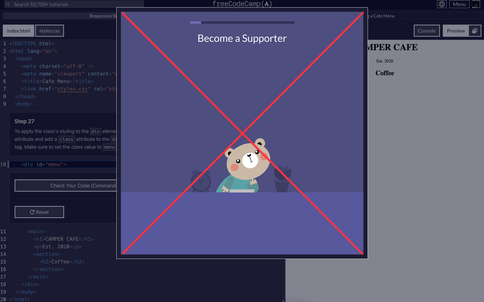

  

<h1 align="center">
  FreeCodeCamp No Donation Pop-up
</h1>

  
  

## Description / 描述

This Tampermonkey script removes the donation popup in FreeCodeCamp.

這個 Tampermonkey 腳本可以移除 FreeCodeCamp 中的捐款彈出式視窗。

## Installation / 安裝

Click [here](https://update.greasyfork.org/scripts/494247/FreeCodeCamp%20No%20Donation%20Pop-up.user.js) to install the script.

點擊 [這裡](https://update.greasyfork.org/scripts/494247/FreeCodeCamp%20No%20Donation%20Pop-up.user.js) 來安裝腳本。

## License / 許可證

This project is licensed under the MIT License. See the [LICENSE](./LICENSE) file for more information.

本專案使用 MIT License。更多資訊請參閱 [LICENSE](./LICENSE) 檔案。